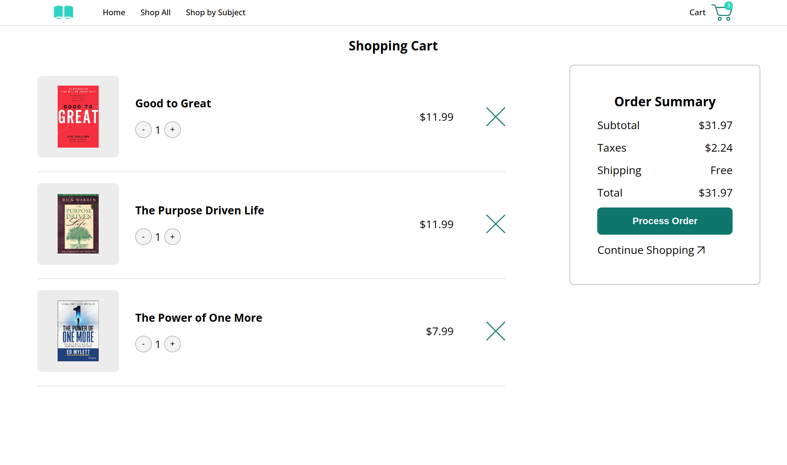

# Thinkfolio

A frontend-based e-commerce bookstore built with React.

<div align="center">
  
[Live Demo](#)



</div>

## Demo

Insert gif or link to demo

## About This Project

The app implements e-commerce store features with books from my personal reading wishlist as example products. Users can browse products by category, click to view detailed product info, add products to the cart, edit cart contents, and visit the cart to simulate a mock checkout process.

## Features

- Browse Home, Shop, Cart, and Product Detail pages
- Add, edit, and remove cart contents
- Hover on cart badge to preview its contents
- View Order Summary in cart including subtotal, taxes, and total
- Responsive design
- Minimalist UI styles
- Nested website menu to efficiently navigate between categories, includes mobile support
- Main page carousel with featured books
- JavaScript object-based book data

## Tech Stack

- **Languages**: JavaScript, HTML, and CSS
- **UI Library**: React
- **Styling**: CSS Modules
- **Build Tool**: Vite
- **Deployment**: Vercel
- **Dependencies**:
  - react-router-dom: Routing
  - react-slick: Main page carousel
  - react-tooltip: Cart badge tooltip
  - uuid: Unique IDs

## Architecture

Located in `src`:

- `components`: React non-page components (book list, increment/decrement button, etc.) and their CSS modules
- `pages`: React page components and their CSS modules
- `data`: Book and megamenu labels/ href data
- `utils`: Utility functions used multiple times in the app
- **index.css**: Global styles
- **Context.jsx**: Context API Provider component for the store
- **main.jsx**: Entry point for the React app; contains the Router Provider component

Located in root:

- `public`: Book cover images, icons, and app screenshots
- **index.html**: Main HTML file containing "root" DOM node for React

## Book Data

The following state data is used to manage the simulated shopping experience. A Books Array is initiated in `bookData.js` that serves as the initial value of `products`. `products` is a state variable shared throughout the whole app using React's Context API.

**Books Array** (initialized in `bookData.js`):
Represents all products in the store, made up of book objects.

A factory function creates the objects with the following template:

```bash
const Book = (title, author, price, category, description) => {
    return {
    id: uuidv4(),
    title,
    author,
    src: getImgPath(author),
    slug: `${author}-${title}`,
    price,
    quantity: 0,
    inCart: false,
    category: category,
    description: description,
    };
};
```

Because `products` is a state variable, a re-render is triggered every time there is a change to the user's cart (either product change or quantity change).

## Run Locally

1. Clone the project in a folder of your choice on your computer

```bash
  git clone git@github.com:mrzamin/bookstore.git
```

2. Navigate to the project directory

```bash
cd bookstore
```

3. Start the server

```bash
npm run dev
```

New additions to the list of book titles for this app are welcome! Please use the [fork and pull request workflow](https://docs.github.com/en/get-started/exploring-projects-on-github/contributing-to-a-projecthttps://docs.github.com/en/get-started/exploring-projects-on-github/contributing-to-a-project).

## What I'd Like to Work On in the Future

- Add local storage to save user's shopping items
- Allow user search
- Add book filters
- Add star ratings for books
- Implement fake REST API endpoints to simulate fetching data from a database or server
- Test the app with React Testing Library
- Fix semantic HTML issues for improved accessibility

## Credits

- App icons from [The Noun Project](https://thenounproject.com/)
- Hero image from [Adobe Express](https://www.adobe.com/express/)
- Font from [Google Fonts](https://fonts.google.com/)
- Design inspiration from:
- [Cengiz Inceoglu](https://dribbble.com/shots/23265949--058-DailyUI-Shopping-Cart)

- [Paulina Preciado] (https://dribbble.com/shots/22404197-URREA-Product-Detail-Page)

- [bn.com](https://www.barnesandnoble.com/)
